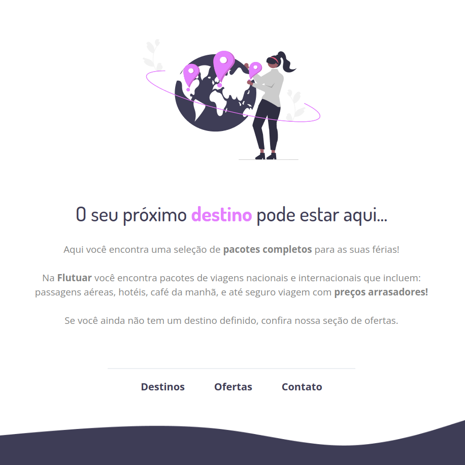
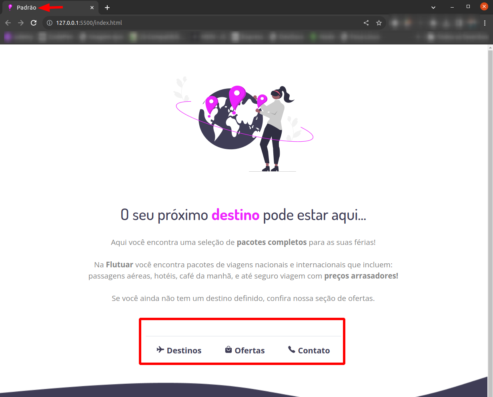

# Projeto Flutuar 

Resolução de um exercício proposto pela Rockseat em um dos módulos do curso Explorer.

O desafio foi replicar uma página estática, cuja premissa é ser um site de uma agência de viagens fictícia. Possui alguns menus básicos referentes aos serviços prestados por essa agência como destinos, ofertas e contato.

Layout:

  

Esse projeto foi desenvolvido com as seguintes tecnologias:

- HTML e CSS
- Git e Github
- Figma

Conforme sugerido opcionalmente, adicionei um Favicon e alguns ícones nos links existentes:

  

